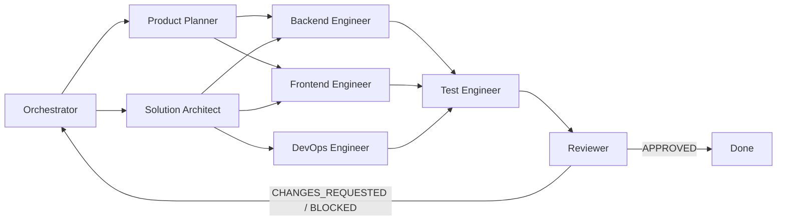

# Codex Agency Agents

[](https://github.com/rivailruiz/codex-agency-agents)
[](https://github.com/rivailruiz/codex-agency-agents)
[](https://github.com/rivailruiz/codex-agency-agents)

Multi-agent system for software delivery in Codex.

Built for execution: technical planning, implementation, validation, standardized handoffs, and final reviewer gate.

Portuguese version: `README.pt-BR.md`.

## What you get

- **8 specialized agents** for the critical delivery stages.
- **4 reusable skills** for recurring tasks.
- **Operational playbooks** for handoff and final review.
- **Portable installer** to apply this kit in any project.
- **Ready-to-run prompts** for fast onboarding.

## Project structure

```text
.
├── AGENTS.md
├── README.md
├── agents/
│   ├── orchestrator.md
│   ├── product-planner.md
│   ├── solution-architect.md
│   ├── backend-engineer.md
│   ├── frontend-engineer.md
│   ├── test-engineer.md
│   ├── devops-engineer.md
│   └── reviewer.md
├── skills/
│   ├── spec-to-tasks/SKILL.md
│   ├── code-implementation/SKILL.md
│   ├── quality-gate/SKILL.md
│   └── release-readiness/SKILL.md
├── playbooks/
│   ├── handoff-standard.md
│   └── final-review-flow.md
├── scripts/
│   ├── install.sh
│   └── uninstall.sh
└── examples/
    └── prompts/
        ├── quickstart.md
        └── handoff-and-review.md
```

## Quickstart (5 minutes)

1. Read `AGENTS.md` to understand the operating model.
2. Start with `agents/orchestrator.md` and provide project context.
3. Run the full loop: backlog -> architecture -> implementation -> QA -> reviewer.

Quick prompt:

```text
Activate the orchestrator from this repository.
Goal: implement [your feature/project].
Follow AGENTS.md, use the standard handoff format, and finish with reviewer.
```

## Delivery flow



## Agents

| Agent | Role | Main output |
|---|---|---|
| `orchestrator` | coordinates the end-to-end flow | plan, status, handoff trail |
| `product-planner` | turns scope into backlog | prioritized tasks with acceptance criteria |
| `solution-architect` | defines technical direction | architecture, contracts, risks |
| `backend-engineer` | builds services and business logic | tested backend + QA handoff |
| `frontend-engineer` | builds UI and user flows | functional interface with tests |
| `test-engineer` | validates criteria and regressions | PASS/FAIL report with evidence |
| `devops-engineer` | prepares pipeline and operations | CI/CD, deploy, observability |
| `reviewer` | final quality gate | APPROVED / CHANGES_REQUESTED / BLOCKED decision |

## Reusable skills

| Skill | Purpose |
|---|---|
| `spec-to-tasks` | converts requirements into testable technical backlog |
| `code-implementation` | guides incremental implementation with evidence |
| `quality-gate` | runs objective PASS/FAIL validation before reviewer |
| `release-readiness` | decides READY/NOT_READY for release |

## Install in another project

Install this kit inside another repository:

```bash
./scripts/install.sh --target /path/to/project
```

Install and add an `AGENTS.md` pointer block in the target project:

```bash
./scripts/install.sh --target /path/to/project --bootstrap-agents
```

Install in symlink mode (best for centralized updates):

```bash
./scripts/install.sh --target /path/to/project --mode symlink --bootstrap-agents
```

Install global skills into Codex Home (`$CODEX_HOME/skills`):

```bash
./scripts/install.sh --target /path/to/project --install-global-skills
```

Uninstall:

```bash
./scripts/uninstall.sh --target /path/to/project
```

## Operational playbooks

- `playbooks/handoff-standard.md`: agent-to-agent handoff contract.
- `playbooks/final-review-flow.md`: mandatory final review gate.

Golden rule: **no evidence, no completion**.

## Prompt examples

- `examples/prompts/quickstart.md`
- `examples/prompts/handoff-and-review.md`

## Best-fit scenarios

- Small teams that need predictable delivery.
- New projects that need execution discipline from day one.
- Teams that want less rework in handoffs and final reviews.

## Expected outcomes

- Less ambiguity between planning and implementation.
- Better traceability for decisions and risks.
- More objective and reliable final reviews.
- Faster delivery cycles with lower rework.
