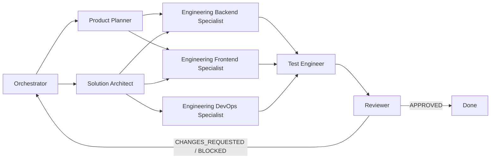

# Codex Agency Agents

[](https://github.com/rivailruiz/codex-agency-agents)
[](https://github.com/rivailruiz/codex-agency-agents)
[](https://github.com/rivailruiz/codex-agency-agents)

Multi-agent system for software delivery in Codex.

Built for execution: technical planning, implementation, validation, standardized handoffs, and final reviewer gate.

## What you get

- **73 total agents**:
- 5 core governance agents for the main execution flow.
- 68 additional specialists across 9 divisions.
- **4 reusable skills** for recurring tasks.
- **Operational playbooks** for handoff and final review.
- **Portable installer** to apply this kit in any project.
- **Ready-to-run prompts** for fast onboarding.

## Project structure

```text
.
├── AGENTS.md
├── README.md
├── agents/
│   ├── orchestrator.md
│   ├── product-planner.md
│   ├── solution-architect.md
│   ├── test-engineer.md
│   ├── reviewer.md
│   └── specialists/
│       ├── README.md
│       ├── design/*.md
│       ├── engineering/*.md
│       ├── marketing/*.md
│       ├── product/*.md
│       ├── project-management/*.md
│       ├── support/*.md
│       ├── testing/*.md
│       ├── spatial-computing/*.md
│       └── specialized/*.md
├── skills/
│   ├── spec-to-tasks/SKILL.md
│   ├── code-implementation/SKILL.md
│   ├── quality-gate/SKILL.md
│   └── release-readiness/SKILL.md
├── playbooks/
│   ├── handoff-standard.md
│   └── final-review-flow.md
├── scripts/
│   ├── install.sh
│   └── uninstall.sh
└── examples/
    └── prompts/
        ├── quickstart.md
        └── handoff-and-review.md
```

## Quickstart (5 minutes)

1. Read `AGENTS.md` to understand the operating model.
2. Start with `agents/orchestrator.md` and provide project context.
3. Run the full loop: backlog -> architecture -> implementation -> QA -> reviewer.

Quick prompt:

```text
Activate the orchestrator from this repository.
Goal: implement [your feature/project].
Follow AGENTS.md, use the standard handoff format, and finish with reviewer.
```

## Delivery flow



## Agents

| Agent | Role | Main output |
|---|---|---|
| `orchestrator` | coordinates the end-to-end flow | plan, status, handoff trail |
| `product-planner` | turns scope into backlog | prioritized tasks with acceptance criteria |
| `solution-architect` | defines technical direction | architecture, contracts, risks |
| `test-engineer` | validates criteria and regressions | PASS/FAIL report with evidence |
| `reviewer` | final quality gate | APPROVED / CHANGES_REQUESTED / BLOCKED decision |
| `agents/specialists/engineering/*` | implementation specialists | domain-specific engineering execution |

Specialist catalog index: `agents/specialists/README.md`.

## Specialists (by division)

| Division | Count | Specialists |
|---|---:|---|
| `design` | 8 | `design-brand-guardian`<br>`design-image-prompt-engineer`<br>`design-inclusive-visuals-specialist`<br>`design-ui-designer`<br>`design-ux-architect`<br>`design-ux-researcher`<br>`design-visual-storyteller`<br>`design-whimsy-injector` |
| `engineering` | 11 | `engineering-ai-engineer`<br>`engineering-autonomous-optimization-architect`<br>`engineering-backend-architect`<br>`engineering-data-engineer`<br>`engineering-devops-automator`<br>`engineering-frontend-developer`<br>`engineering-mobile-app-builder`<br>`engineering-rapid-prototyper`<br>`engineering-security-engineer`<br>`engineering-senior-developer`<br>`engineering-technical-writer` |
| `marketing` | 11 | `marketing-app-store-optimizer`<br>`marketing-content-creator`<br>`marketing-growth-hacker`<br>`marketing-instagram-curator`<br>`marketing-reddit-community-builder`<br>`marketing-social-media-strategist`<br>`marketing-tiktok-strategist`<br>`marketing-twitter-engager`<br>`marketing-wechat-official-account`<br>`marketing-xiaohongshu-specialist`<br>`marketing-zhihu-strategist` |
| `product` | 4 | `product-behavioral-nudge-engine`<br>`product-feedback-synthesizer`<br>`product-sprint-prioritizer`<br>`product-trend-researcher` |
| `project-management` | 5 | `project-management-experiment-tracker`<br>`project-management-project-shepherd`<br>`project-management-studio-operations`<br>`project-management-studio-producer`<br>`project-manager-senior` |
| `support` | 6 | `support-analytics-reporter`<br>`support-executive-summary-generator`<br>`support-finance-tracker`<br>`support-infrastructure-maintainer`<br>`support-legal-compliance-checker`<br>`support-support-responder` |
| `testing` | 8 | `testing-accessibility-auditor`<br>`testing-api-tester`<br>`testing-evidence-collector`<br>`testing-performance-benchmarker`<br>`testing-reality-checker`<br>`testing-test-results-analyzer`<br>`testing-tool-evaluator`<br>`testing-workflow-optimizer` |
| `spatial-computing` | 6 | `macos-spatial-metal-engineer`<br>`terminal-integration-specialist`<br>`visionos-spatial-engineer`<br>`xr-cockpit-interaction-specialist`<br>`xr-immersive-developer`<br>`xr-interface-architect` |
| `specialized` | 9 | `agentic-identity-trust`<br>`agents-orchestrator`<br>`data-analytics-reporter`<br>`data-consolidation-agent`<br>`lsp-index-engineer`<br>`report-distribution-agent`<br>`sales-data-extraction-agent`<br>`specialized-cultural-intelligence-strategist`<br>`specialized-developer-advocate` |

## Reusable skills

| Skill | Purpose |
|---|---|
| `spec-to-tasks` | converts requirements into testable technical backlog |
| `code-implementation` | guides incremental implementation with evidence |
| `quality-gate` | runs objective PASS/FAIL validation before reviewer |
| `release-readiness` | decides READY/NOT_READY for release |

## Install in another project

Install this kit inside another repository:

```bash
./scripts/install.sh --target /path/to/project
```

Install and add an `AGENTS.md` pointer block in the target project:

```bash
./scripts/install.sh --target /path/to/project --bootstrap-agents
```

Install in symlink mode (best for centralized updates):

```bash
./scripts/install.sh --target /path/to/project --mode symlink --bootstrap-agents
```

Install global skills into Codex Home (`$CODEX_HOME/skills`):

```bash
./scripts/install.sh --target /path/to/project --install-global-skills
```

Uninstall:

```bash
./scripts/uninstall.sh --target /path/to/project
```

## Operational playbooks

- `playbooks/handoff-standard.md`: agent-to-agent handoff contract.
- `playbooks/final-review-flow.md`: mandatory final review gate.

Golden rule: **no evidence, no completion**.

## Prompt examples

- `examples/prompts/quickstart.md`
- `examples/prompts/handoff-and-review.md`

## Best-fit scenarios

- Small teams that need predictable delivery.
- New projects that need execution discipline from day one.
- Teams that want less rework in handoffs and final reviews.

## Expected outcomes

- Less ambiguity between planning and implementation.
- Better traceability for decisions and risks.
- More objective and reliable final reviews.
- Faster delivery cycles with lower rework.
