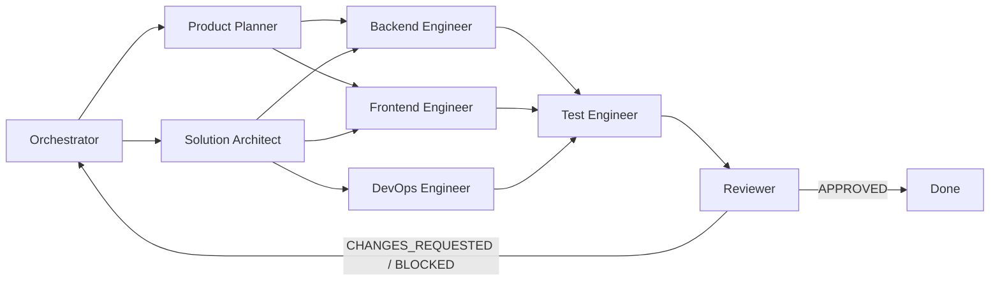

# Codex Agency Agents

[](https://github.com/rivailruiz/codex-agency-agents)
[](https://github.com/rivailruiz/codex-agency-agents)
[](https://github.com/rivailruiz/codex-agency-agents)

Sistema multiagente para software delivery no Codex.

Foco total em execucao real: planejamento tecnico, implementacao, validacao, handoff padronizado e gate final com reviewer.

## O que voce ganha

- **76 agentes no total**:
- 8 agentes core para o fluxo principal de entrega.
- 68 especialistas adicionais distribuidos em 9 divisoes.
- **4 skills reutilizaveis** para acelerar tarefas recorrentes.
- **playbooks operacionais** de handoff e revisao final.
- **instalador portavel** para aplicar o kit em qualquer projeto.
- **prompts prontos** para iniciar sem friccao.

## Estrutura do projeto

```text
.
├── AGENTS.md
├── README.md
├── agents/
│   ├── orchestrator.md
│   ├── product-planner.md
│   ├── solution-architect.md
│   ├── backend-engineer.md
│   ├── frontend-engineer.md
│   ├── test-engineer.md
│   ├── devops-engineer.md
│   ├── reviewer.md
│   └── specialists/
│       ├── README.md
│       ├── design/*.md
│       ├── engineering/*.md
│       ├── marketing/*.md
│       ├── product/*.md
│       ├── project-management/*.md
│       ├── support/*.md
│       ├── testing/*.md
│       ├── spatial-computing/*.md
│       └── specialized/*.md
├── skills/
│   ├── spec-to-tasks/SKILL.md
│   ├── code-implementation/SKILL.md
│   ├── quality-gate/SKILL.md
│   └── release-readiness/SKILL.md
├── playbooks/
│   ├── handoff-standard.md
│   └── final-review-flow.md
├── scripts/
│   ├── install.sh
│   └── uninstall.sh
└── examples/
    └── prompts/
        ├── quickstart.md
        └── handoff-and-review.md
```

## Quickstart (5 minutos)

1. Leia `AGENTS.md` para entender o modelo de operacao.
2. Inicie pelo `agents/orchestrator.md` com contexto do projeto.
3. Rode o ciclo completo: backlog -> arquitetura -> implementacao -> QA -> reviewer.

Prompt rapido:

```text
Ative o orchestrator deste repositorio.
Objetivo: implementar [sua feature/projeto].
Siga AGENTS.md, use handoff padrao e finalize com reviewer.
```

## Fluxo de entrega



## Agentes

| Agente | Papel | Entrega principal |
|---|---|---|
| `orchestrator` | coordena o fluxo ponta a ponta | plano, status, trilha de handoffs |
| `product-planner` | transforma escopo em backlog | tarefas priorizadas com aceite |
| `solution-architect` | define direcao tecnica | arquitetura, contratos, riscos |
| `backend-engineer` | implementa servicos e regras de negocio | backend testado e handoff para QA |
| `frontend-engineer` | implementa UI e fluxos de usuario | interface funcional com testes |
| `test-engineer` | valida criterios e regressao | relatorio PASS/FAIL com evidencias |
| `devops-engineer` | prepara pipeline e operacao | CI/CD, deploy e observabilidade |
| `reviewer` | gate final de qualidade | decisao APPROVED / CHANGES_REQUESTED / BLOCKED |

Indice do catalogo de especialistas: `agents/specialists/README.md`.

## Skills reutilizaveis

| Skill | Para que serve |
|---|---|
| `spec-to-tasks` | converte requisitos em backlog tecnico testavel |
| `code-implementation` | guia implementacao incremental com evidencia |
| `quality-gate` | aplica validacao objetiva PASS/FAIL pre-review |
| `release-readiness` | decide READY/NOT_READY para release |

## Instalacao em outro projeto

Instalar o kit dentro de outro repositorio:

```bash
./scripts/install.sh --target /caminho/do/projeto
```

Instalar e adicionar ponteiro no `AGENTS.md` do projeto destino:

```bash
./scripts/install.sh --target /caminho/do/projeto --bootstrap-agents
```

Instalar em modo symlink (ideal para manter atualizacoes centralizadas):

```bash
./scripts/install.sh --target /caminho/do/projeto --mode symlink --bootstrap-agents
```

Instalar skills globais no Codex Home (`$CODEX_HOME/skills`):

```bash
./scripts/install.sh --target /caminho/do/projeto --install-global-skills
```

Desinstalar:

```bash
./scripts/uninstall.sh --target /caminho/do/projeto
```

## Playbooks operacionais

- `playbooks/handoff-standard.md`: contrato de handoff entre agentes.
- `playbooks/final-review-flow.md`: gate final obrigatorio com reviewer.

Regra de ouro: **sem evidencia, sem conclusao**.

## Exemplos de prompt

- `examples/prompts/quickstart.md`
- `examples/prompts/handoff-and-review.md`

## Quando usar este projeto

- Squad pequeno que precisa entregar com previsibilidade.
- Projeto novo que precisa de disciplina de execucao desde o dia 1.
- Time que quer reduzir retrabalho em handoffs e revisoes finais.

## Resultado esperado

- Menos ambiguidade entre planejamento e implementacao.
- Melhor rastreabilidade de decisoes e riscos.
- Revisao final mais objetiva e confiavel.
- Entregas mais frequentes com menor retrabalho.
